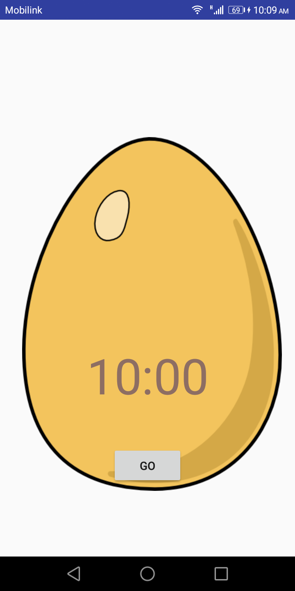

# Warmup_Week04_Day02 🔥
---
# Egg Timer App
## What you'll do
- Create an app and add `Button` and a `ImageView` and `TextView` to the layout.
- Manipulate each element in the `ConstraintLayout` to constrain them to the margins and other elements.
- Remove the app bar from main activity
- Change UI element attributes.
- Extract hardcoded strings into string resources.
- Implement click-handler method to count down timer on the screen when the user taps `Button`.

## The Egg timer app consists of `Button` and `TextView` and `ImageView`. When the user taps the `Button`, it displays count down timer on the screen.
## Here's what the finished app looks like:

